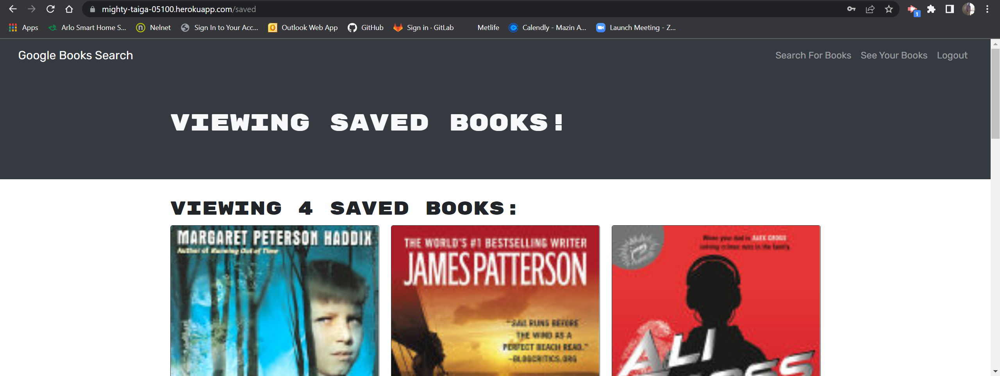

# Google Book Search MERN Stack Challenge

## Description:

The Book search engine uses the MERN stack and with a React front end, MongoDB database, and Node js & Express js server. It's set up to allow users to save book searches to their profile and view the books and their details. The application is built using Google Books API so that users can click a link that takes them to google books. The search engine is built with GraphQL API and Apollo Server.

# Heroku

https://mighty-taiga-05100.herokuapp.com/

# Table of Contents

  - [Installation](#installation)
  - [Technologies](#technologies)
  - [Credits](#credits)
  - [License](#license)
  - [Contribution](#contributing)
  - [Tests](#tests)
  - [Questions](#questions)
  - [Screenshots](#screenshots)

  ## Installation:

   Make sure you have MongoDB installed on your machine (if you don't, follow the instructions on the MongoDB Website). Clone the repo. Install dependencies with npm i. Run ```npm start``` to run the server. 


## Technologies
 
* JavaScript
* Node.js
* Express
* React
* Apollo Server
* Graphql
* Mongodb
* Mongoose
* Dotenv
* Heroku

## Credits:

  Made by [DonL](https://github.com/DonL44)


  ## License:

  For more information about licenses, please visit:

  [License](https://opensource.org/licenses/MIT)

  ## Contributing:

  [](CODE_OF_CONDUCT.md)
  
  The project is open-source

  ## Screenshots
  

  

  

  

  

  ## Tests:

  No Testing

  
  ## Questions:

  For any questions you may have, please visit my Github profile:
  - [Don L's Github Profile](https://github.com/DonL44)

  If you have any additional questions, feel free to email them to me:
  - [Email](Donovan1478@yahoo.com)